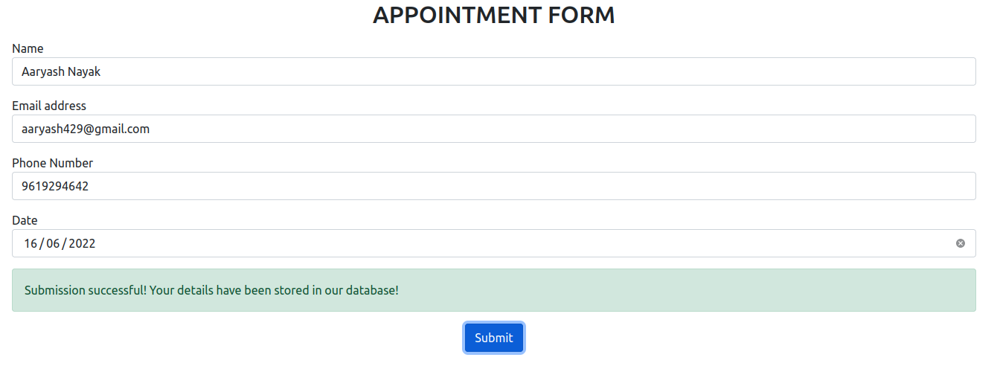
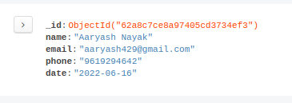
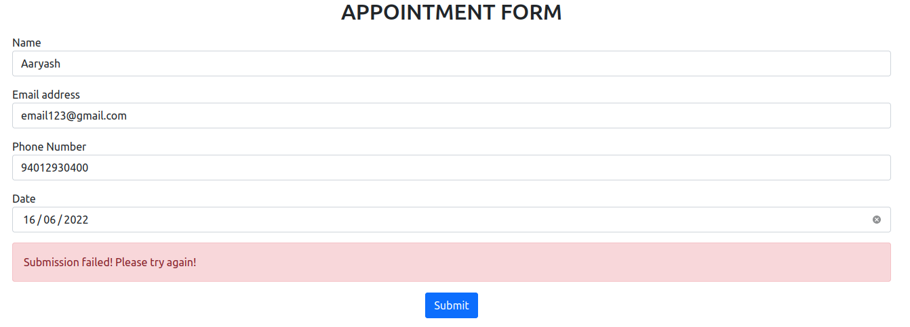

React JSX code in public/jsx folder.  
Uploads form information to local mongodb database.  
On successful upload :  

 
 
Database (MongoDB, using MongoDB Compass) :  

 
 
On failure (Database down/Server down) :  

 
 
Button after being pressed (Informs user that form is being submitted, is grayed out) :  

